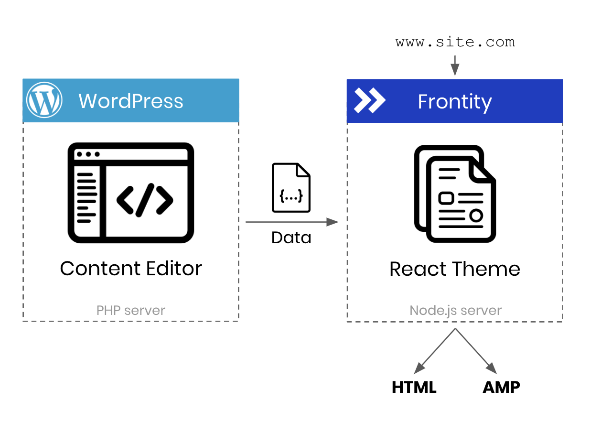

# Frontity Documentation

This is the public documentation for **Frontity**

You can view this documentation at [Frontity Docs](https://docs.frontity.org/).

## What is Frontity?

<<<<<<< HEAD
[Frontity](https://frontity.org/) is a free and [open source framework](https://github.com/frontity/frontity) to develop WordPress themes based on React JS. In other words, it allows to build a **React frontend** for a headless WordPress site, which serves its data via the WordPress REST API.
=======
### **A React framework to create WordPress themes**

Frontity is a free and open source framework to develop WordPress themes based on React JS. In other words, it allows to build a **React frontend** for a [headless WordPress](https://www.elegantthemes.com/blog/wordpress/headless-wordpress) site, which serves its data via the WordPress REST API.

This approach has plenty of advantages, but in order to build a WordPress theme with React there are a **lot of things** that developers need **to learn** and configure: _bundling_, _transpiling_, _routing_, _server rendering_, _retrieving data from WordPress_, _managing state_, or _managing css_, among many others.

Next.js and GatbsyJS are two great React frameworks that can work with WordPress but none of them is exclusively focused on this CMS. Therefore, there’s still some **complex configuration** and additional tooling left to the developer.

Frontity is an opinionated React framework focused on WordPress which aims to make everything simpler, even for those developers who are less familiar with React:

* **Focused on WordPress**: each part of the framework has been simplified and optimized to be used with WordPress.
* **Opinionated framework**: developers don’t need to figure out what tools to use for things like css or state management.

This all means that everything is ready so you can jump in and create a new amazing WordPress theme using React right away.

### **An alternative rendering engine for WordPress**

Frontity can also be explained as an alternative rendering engine for WordPress.

In the past, the only way to get HTML out of WordPress was to use its **PHP** rendering engine.

When the [REST API](https://developer.wordpress.org/rest-api/) was merged into core in WordPress 4.7, developers were **no longer limited** to the PHP rendering engine. They could retrieve their WordPress content and use it wherever they want, which opened a new world of possibilities.

One of those possibilities is to create WordPress themes using React. That’s where Frontity comes into play.

## **Why WordPress and React?**

As of April, WordPress powers over [33% of the web](https://wordpress.org/news/2019/03/one-third-of-the-web/). Its **market share** has been growing over the last years and it shows no signs of slowing down.

With the shift to Gutenberg as well as the rise of [headless CMS](https://css-tricks.com/what-is-a-headless-cms/) approaches, the WordPress community has started considering React for their projects. Beside this, modern libraries like React are growing popularity and becoming essential to rich user experiences.

If **WordPress** is great and **React** too, why not **combine** the two? Especially if you want to build a CMS-powered site with modern web development tools.

We believe this JavaScript-based approach is already accelerating things in the WordPress ecosystem. There’s no better time to start getting familiar with it.

## **How does Frontity work?**

With Frontity, you can still use your WordPress dashboard to edit and manage your content as you usually do. If you make changes, content will automatically update on Frontity.

Frontity apps live in a Node.js server tailored for WordPress.

* It uses the WP REST API to retrieve content and generate the final HTML.
* It is also capable of generating AMP pages with the same React code and CSS.

**Why a different Node.js server?**

React is a JavaScript library. In order to generate HTML for the visitors or Google, the server needs to be able to run JavaScript as well.

> _In theory a PHP server can send an empty HTML with the JavaScript files and the visitor will see the page after the JavaScript has loaded, but it is not a good user experience and certainly not recommended if your site needs to rank in Google._

**Frontity** is prepared to be hosted either in a regular Node.js server or in **serverless** services. That makes it super cheap and infinitely scalable.


We are working on other possible installations, although we strongly recommend this one. You can check them at [possible installations page](installation-and-deploy/possible-architectures.md).

>>>>>>> dd570de974bf9c10295f1872ef5c0e6e97cfc3b1

## What Does this Repository Contain?

<<<<<<< HEAD
This repository contains:
=======
Frontity and its extensions will help save you a lot of development time while allowing you to enjoy all of the latest technology trends that are already configured for you. _\*\*_You can check them out in detail here: [Frontity Features page](frontity-features/).
>>>>>>> dd570de974bf9c10295f1872ef5c0e6e97cfc3b1

- [Documentation](https://github.com/frontity/gitbook-docs/tree/master) - the source docs of the [documentation site for Frontity](https://docs.frontity.org/)
- [Contributing Guidelines](https://github.com/frontity/gitbook-docs/tree/master/CONTRIBUTING.md) - a guide on how to contribute to the Frontity documentation

## How to Contribute

Contributing to the Frontity documentation should be an enjoyable experience, as such we have created a set of [contributing guidelines](https://github.com/frontity/gitbook-docs/tree/master/CONTRIBUTING.md) to help you do so.

We have tried to make contributing to the Frontity documentation as easy as possible, especially for those new to Open Source. If anything is unclear or you have any questions then please use our [community forum](https://community.frontity.org/c/docs-and-tutorials/29) to discuss your contribution and how best to make it.

## License

<<<<<<< HEAD
The ZEIT Now documentation is an open source project released under the [Apache License 2.0](https://github.com/frontity/gitbook-docs/tree/master/LICENSE.md).
=======
If you still have any questions about Frontity, please feel free to ask in our [community forum](https://community.frontity.org).
>>>>>>> dd570de974bf9c10295f1872ef5c0e6e97cfc3b1

## Get In Touch

<<<<<<< HEAD
If you'd like to share your feedback or have any questions or suggestions regarding this documentation, feel free to reach out to us on our [community forum](https://community.frontity.org/c/docs-and-tutorials/29)
=======

\*\*\*\*[**Subscribe**](https://frontity.org/#newsletter) to our newsletter to **get notified** of the ****latest framework updates and news.

>>>>>>> dd570de974bf9c10295f1872ef5c0e6e97cfc3b1

There you will find both members of the community and staff who are happy to help answer questions on anything Frontity related.