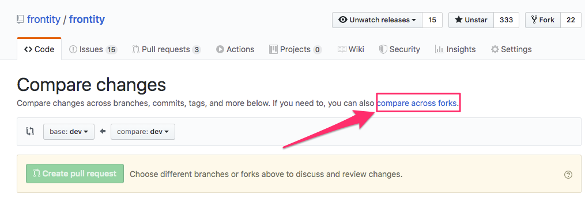

# Code Contributions

Frontity, as an open source project, welcomes everyone to contribute with code, so we have tried to make it as easy as possible.

The most common way for suggesting improvements to Frontity \(and most of the projects\) is to copy the Frontity project to your own repository and make there all the changes you want. Once you consider they are okay, make a pull request to include them in Frontity.


Before starting, the only **prerequisite is to have Node 10 installed in your computer**.


### Quick guide

1. Fork this [repository](https://github.com/frontity/frontity) and clone your fork.
2. Run `npm install` in the root folder.
3. Run `cd examples/mars-theme-example/` to go to the example directory.
4. Run `npx frontity dev` to start Frontity with mars-theme on [localhost:3000](http://localhost:3000/).
5. Make any changes you consider to the packages.

   > **WARNING: After adding/removing dependencies to a package, go back to the root and do npm install again.**

6. Run `npm test` in the root to check if the fork passes the tests.
7. Commit and push to your fork.
8. Open a Pull Request detailing the changes.

### Step by step guide

**1. Fork this** [**repository**](https://github.com/frontity/frontity)**:**

You can go to [our repository](https://github.com/frontity/frontity/), click on **"Fork"** at the right-top corner and select your user.


After doing this, you will create Frontity project at your own repository so you can access and modify it at: https://github.com/_{YOURUSERNAME}_/frontity/.

**2. Clone your own fork:**

This should be made to work on it on a local environment. If you are not using a Git Graphical User Interface \(like GitKraken or SourceTree\), you can clone your fork on the console by changing the current working directory to the location where you want the cloned directory to be made and running the following command:

```text
git clone https://github.com/YOURUSERNAME/frontity.git
```

It will create a folder named “frontity” inside your current directory, and we will work on it from now on.

**3. Run `npm install` on the root folder:**

Make sure you are at the root folder of Frontity project and run `npm install`, don't do it on the packages.

At this point, before starting your work, it is a good practice to have a place to see all the changes you are making, and check if your new code is working properly. For doing so, we have provided some tools to run mars-theme in your local server: 

**4. Go to /examples/mars-theme-example/** :

To access an example to test your changes you should run the command `cd examples/mars-theme-example/`.

To check your modifications, being in the folder previously mentioned, run **`npx frontity dev`** and it will start Frontity with mars-theme on [localhost:3000](http://localhost:3000/). It will open automatically a new tab on your browser.

**5. Run your local server:**

**6. Make any changes you consider**:

At this point, you are able to make any improvements you want to any of the packages \(not only **mars-theme**\), and after saving your code changes, you should check if they are working by refreshing _localhost:3000_. For managing the files and the code, we strongly recommend to use a code editor like Visual Studio Code.


_**WARNING: After adding/removing dependencies to a package, you must go back to the root and do `npm install` again**_


**7. Run the tests:**

Once you have finished, for adding your changes to Frontity project, your fork must pass all the tests. For checking it you should run `npm test` **in the root folder**. This will tell you if the tests are okay and in case they are not, they will tell you which ones aren't.

If you find some errors, you can try:

* Run `npm test` on a package to detect where is the problem.
* Run `npm run test:push`in the root to pass all tests without cache. It is useful for typescript tests.

**8. Commit and push to your fork:**

Again, we recommend you to use a Git Graphical User Interface like GitKraken, but it can also be done in the console if wanted.

**9. Open a Pull Request**

At this point, your fork should be ready to be merged to Frontity, so you can open a Pull Request and we will review it. Make sure to select a descriptive name and follow the template.

For opening one you have to go to [Frontity's pull requests](https://github.com/frontity/frontity/compare) page and select **compare across forks.**



Select your own repository and **the dev branch** on Frontity, and **create the pull request**.



Still have questions? Ask [the community](https://community.frontity.org/)! We are here to help 😊



