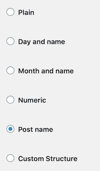

# 🚀 Getting started

👋 Welcome! You've just taken your first step on the path to mastering Frontity.

Frontity is a **React-based framework** that enables you to easily build a frontend for a headless \(or decoupled\) WordPress site. Your WordPress site serves its data via the REST-API. Frontity framework is open source and free to use.

## Table of Contents

* [Installation requirements](./#installation-requirements)
* [Initial checks](./#initial-checks)
  * [WordPress](./#wordpress)
    * [Have a proper WordPress version](./#have-a-proper-wordpress-version)
    * [Have set the right REST API URL](./#have-set-the-right-rest-api-url)
    * [Have pretty permalinks activated](./#have-pretty-permalinks-activated)
  * [Node.js](./#nodejs)
    * [Have Node.js and npm installed](./#have-nodejs-and-npm-installed)
* [Get up and running](./#get-up-and-running)

## Installation requirements

To get started with Frontity you will need:

* **A WordPress installation** - This can be hosted locally, on a web-server, or you can also use a site hosted on wordpress.com

  However, when you spin up your first Frontity project you will initially be connected to our test site so you won't be without content when you first try Frontity

* **Node.js installed in your computer** - If you don't already have it you can get **Node.js** from [the official site](https://nodejs.org/). This will also install **npm** and **npx** along with Node.js

  You will use these to run Frontity commands during the set-up and development of your project

> For those coming from WordPress it might be worth noting that **Frontity** runs on **Node**, so it needs to be deployed in a different server than your WordPress. If you want to learn more about this, visit our [GitHub repo](https://github.com/frontity/frontity#why-a-different-nodejs-server) or see the [Architecture](./) section arch these docs.

## Initial checks

### WordPress

#### Have a proper WordPress version

Frontity depends on the WordPress REST-API. If you have a recent version of WordPress installed, or if you're using wordpress.com then you should be good to go.

To check that the WordPress REST-API is working you can type one of the following into your browser's address bar. You should get a lot of complicated looking stuff in your browser. Don't worry, this is JSON and Frontity is very happy with this.

#### Have set the right REST API URL

For a self-hosted WordPress site \(i.e. local or web based\):

```text
http://your-wp-domain.com/wp-json
```

For wordpress.com:

```text
https://public-api.wordpress.com/wp/v2/sites/your-wp-site.wordpress.com
```

#### Have pretty permalinks activated

Check also that you are using one of the pretty permalinks options, rather than the plain one, in `Settings->Permalinks`.



### Node.js

#### Have Node.js and npm installed

To test if you have Node.js installed open your terminal and run:

```text
node -v
```

```text
npm -v
```

Once you have a WordPress site and Node.js you're good to go and all set to get up and running....

## Get up and running

No time to waste? Then head straight over to our [**Quick start guide**](quick-start-guide.md) to get up and running right away.

Want all the gen before you get started? Then read through our [**Learning Frontity**](../learning-frontity/) section for in-depth insights into working with Frontity.

Need more info? Our [**Community forum**](https://community.frontity.org/) is the perfect place to ask any questions and share your feedback. We look forward to seeing you there.

Frontity is open source and welcomes contributions. There are many ways to support the project and get involved. Please see the [**Contributing**](../contributing/) section for more info.


Still have questions? Come and join us in [the community](https://community.frontity.org/) and ask there! We are here to help 😊


