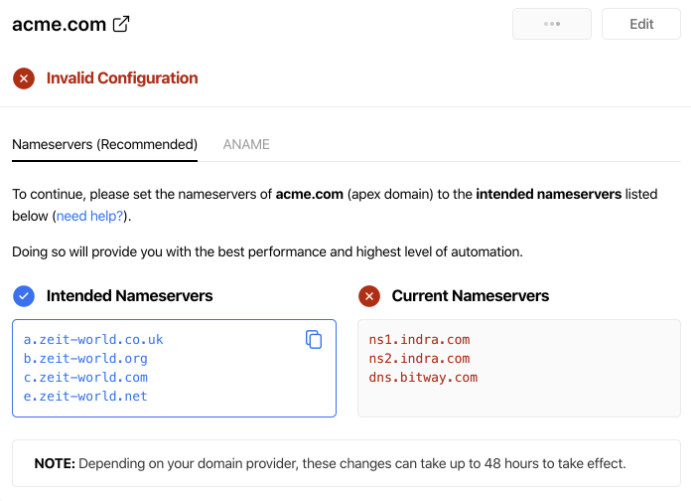

# Deploy Frontity using `now` (Vercel)

In [their own words](https://vercel.com/docs) : *Vercel is a cloud platform for static sites and **Serverless Functions** that fits perfectly with your workflow. It enables developers to host Jamstack websites and web services that **deploy instantly**, **scale automatically**, and **requires no supervision**, all with **no configuration**.*

We strongly recommend this service as it is serverless, cheap, includes CDN, and really easy to set up. It also supports the cache technique stale-while-revalidate (they name it [Serverless Pre-Rendering](https://vercel.com/blog/serverless-pre-rendering)), a powerful way to improve your website speed.

To be able to deploy with now you need to have a Vercel account. You can [signup here](https://vercel.com/signup).

Once you have an account you have to [login](https://vercel.com/docs/now-cli#commands/login) to Vercel from the terminal

```text
> npx now login
```

These are the instructions to deploy a Frontity project on Vercel using `now`, once you are ready to deploy your project:

### Create a [`now.json`](https://vercel.com/docs/configuration?query=now.json#introduction/configuration-reference)

1. Create this `now.json` file and save it in the r oot your Frontity project.

```text
{
  "version": 2,
  "builds": [
    {
      "src": "package.json",
      "use": "@frontity/now"
    }
  ]
}
```

### Deploy

Deploy Frontity using the [`now` command](https://vercel.com/docs/now-cli#getting-started) (from the root of your project):

```text
> npx now
```

You should get something like this

```text
? Set up and deploy “~/PROJECTS/2020/FRONTITY/DEMOS/my-frontity-project”? [Y/n] y
? Which scope do you want to deploy to? myVercelScope
? Link to existing project? [y/N] n
? What’s your project’s name? my-frontity-project
? In which directory is your code located? my-frontity-project/
🔗  Linked to vercel-username/my-frontity-project (created .now and added it to .gitignore)
🔍  Inspect: https://vercel.co/vercel-username/my-frontity-project/9ue4zsq9n [26s]
✅  Production: https://my-frontity-project.now.sh [copied to clipboard] [1m]
📝  Deployed to production. Run `now --prod` to overwrite later (https://vercel.ink/2F).
💡  To change the domain or build command, go to https://vercel.com/vercel-username/my-frontity-project/settings
```

> More about Vercel [scopes ](https://vercel.com/docs/v2/platform/users-and-teams)

Vercel (through its `now` command) will assign you a domain (something like _your-project-name.now.sh_) that that will allow you to check your site online

From this deploy example we have got the following URL's:

* **Live URL** ([https://my-frontity-project.now.sh](https://my-frontity-project.now.sh)) → Our temporary URL assigned automatically by Now, We can check (and share) our site online from this URL 
* **Inspect** ([https://vercel.com/vercel-username/my-frontity-project/settings](https://vercel.com/vercel-username/my-frontity-project/settings)) → Here we can check the status of our site and check the logs among other things
* **Project Settings** ([https://vercel.com/vercel-username/my-frontity-project/settings](https://vercel.com/vercel-username/my-frontity-project/settings)) → Here we can change domain and build settings among other things

## Deploy your site under a custom domain

To deploy your site under a custom domain you have to

* configure your Frontity app to point to that custom domain 
* configure your custom domain for your project in the Vercel settings
* add Vercel nameservers for your custom domain from your domain provider 

...before deploying it

### Add your custom domain in your project settings

From the project settings URL provided in our previous deploy ([https://vercel.com/vercel-username/my-frontity-project/settings](https://vercel.com/vercel-username/my-frontity-project/settings) in our example) we can set a custom domain


Add it, and you will be provided by a [set a nameservers](https://vercel.com/docs/v2/custom-domains#step-4:-configuring-the-domain) you can use in your domain provider to point your custom domain to the Vercel nameservers



### Add Vercel nameservers in your domain provider

You need to set [Vercel nameservers](https://vercel.com/docs/v2/custom-domains/#option-2:-using-external-nameservers) as custom DNS of your custom domain from your domain provider site


If you don't know how to do this, contact your domain provider (GoDaddy, CloudFlare, etc)


### Deploy

Then, deploy Frontity using this command (from the root of your project):

```text
> npx now --prod
```

You should get something like this

```text
⬢  my-frontity-project  npx now --prod

🔍  Inspect: https://vercel.com/vercel-username/my-frontity-project/9ue4zsq9n [2s]
✅  Production: https://mycustomtomain.com [copied to clipboard] [4s]

This will create a deploy and assign it to your real site url.

> More about Vercel [deployments](https://vercel.com/docs/v2/platform/deployments)
```


Still have questions? Ask [the community](https://community.frontity.org/)! We are here to help 😊


