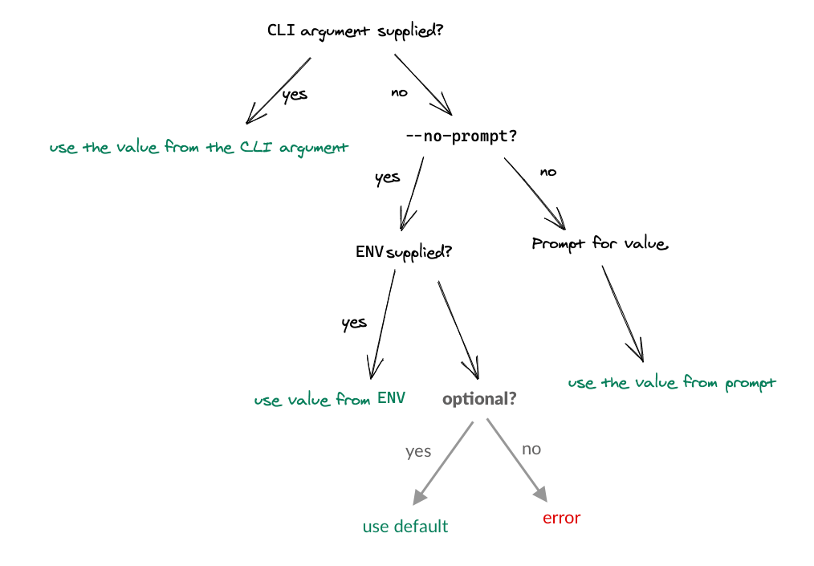

# `create-package`

The `create-package` command creates a new Frontity package in a project.
Launch this command from the root of the Frontity project

```shell
npx frontity create-package [package-name] [options]
```

## Arguments

### **`[package-name]`**

This argument sets the _name_ of your Frontity package.
The `create-package` command will create a folder named `[package-name]` under `packages`.
It will also add the proper dependency in the `package.json` of your Frontity project

### **`[options]`**

|     Option      | Description                                     |
| :-------------: | ----------------------------------------------- |
| `-n <value>`, `--namespace <value>`  | Sets the [namespace](https://docs.frontity.org/learning-frontity/namespaces) for this package                 |
| `--no-prompt`  | Skips prompting the user for options          |
| `-h`, `--open`  | Output usage information |

##### The `--no-prompt` option

You can set the name of the package [as an environmental variable called `FRONTITY_NAME`](https://github.com/frontity/frontity/blob/107d3543ce5463186809b7e6f50ca31ffbdc107d/packages/frontity/src/cli/create-package.ts#L32).

If you pass the `--no-prompt` flag, the CLI will use the name from that `FRONTITY_NAME`.

If the CLI cannot find a `FRONTITY_NAME` environmental variable, it will prompt for the name of the package

This is the scheme followed by the CLI to get the name of the package 




## Examples

- Create a custom theme package named `my-custom-project`

```shell
>  npx frontity create-package my-custom-theme
? Enter the namespace of the package: theme
✔ Adding package.json.
✔ Adding src/index.js.
✔ Installing package my-custom-theme.

New package "my-custom-theme" created.
```
