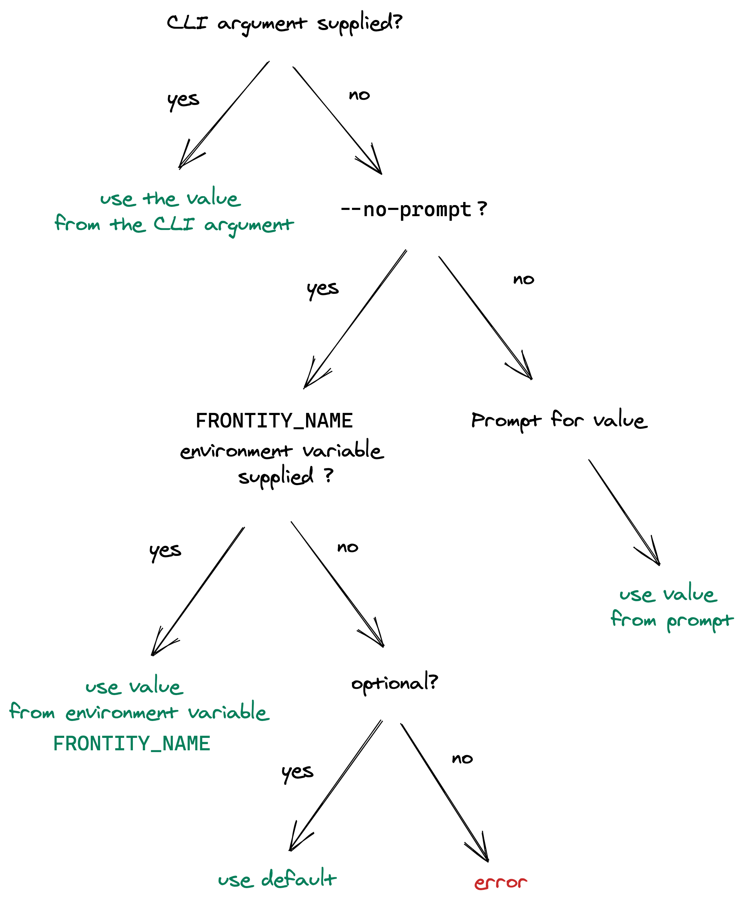

# Environment Variables

The Frontity CLI allows to define some options/flags for some of the Frontity commands via environment variables.

If some of these environment variables are detected the proper values will be set for the proper commands:

## [`create`](https://docs.frontity.org/frontity-cli/create-commands#create) & [`create-package`](https://docs.frontity.org/frontity-cli/create-commands#create-package)

### FRONTITY_NAME

 The `FRONTITY_NAME` environment variable can be used to supply the name for a Frontity project or a Frontity package.

If no value is supplied from the CLI when using the [`create`](https://docs.frontity.org/frontity-cli/create-commands#create) or [`create-package`](https://docs.frontity.org/frontity-cli/create-commands#create-package), and the [`--no-prompt`](https://docs.frontity.org/frontity-cli/create-commands#the-no-prompt-option) flag is used, then the name of the project/package will be taken from the `FRONTITY_NAME` environment variable if it's defined.

If the CLI cannot find a [`FRONTITY_NAME`](https://docs.frontity.org/frontity-cli/environment-variables#frontity_name) environmental variable, it will prompt for the name of the package

This is the scheme followed by the CLI to get the name of the package



## [`dev`](https://docs.frontity.org/frontity-cli/run-commands#dev)

### `FRONTITY_DEV_TARGET`

Create bundles with `es5`, `module` or `both`. Default target is `both`.

If detected, and no `--target <target>` option is defined for [`dev`](https://docs.frontity.org/frontity-cli/run-commands#dev) Frontity command, this environment variable value will be applied.

_Example:_

```text
FRONTITY_DEV_TARGET=module
FRONTITY_DEV_TARGET=es
```

### `FRONTITY_DEV_PORT`

Runs the server on a custom port. Default is `3000`.

If detected, and no `--port <port>` option is defined for [`dev`](https://docs.frontity.org/frontity-cli/run-commands#dev) Frontity command, this environment variable value will be applied.

_Example:_

```text
FRONTITY_DEV_PORT=3002
```

### `FRONTITY_DEV_HTTPS`

Runs the server using https.

_Example:_

```text
FRONTITY_DEV_HTTPS=true
```

### `FRONTITY_DEV_PRODUCTION`

`frontity dev` by default runs the server in "development mode" \(no optimizations, uses the dev build of react, etc.\). Setting this variable makes it run in "production mode".

_Example:_

```text
FRONTITY_DEV_PRODUCTION=true
```

### `FRONTITY_DEV_PUBLIC_PATH`

Set the public path for static assets. Default path is `/static/`.

If detected, and no `--public-path` flag is defined for [`dev`](https://docs.frontity.org/frontity-cli/run-commands#dev) Frontity command, this environment variable value will be applied.

_Example:_

```text
FRONTITY_DEV_PUBLIC_PATH=/assets/
```

### `FRONTITY_DEV_DONT_OPEN_BROWSER`

Don't open a browser window after the Frontity server has been started.

_Example:_

```text
FRONTITY_DEV_DONT_OPEN_BROWSER=true
```

## [`build`](https://docs.frontity.org/frontity-cli/build-commands#build)

### `FRONTITY_BUILD_TARGET`

Create bundles with `es5`, `module` or `both`. Default target is `both`.

If detected, and no [`--public-path`](https://docs.frontity.org/frontity-cli/build-commands#the-publicpath-option) option is defined for [`build`](https://docs.frontity.org/frontity-cli/build-commands#build) Frontity command, this environment variable will be applied.

_Example:_

```text
FRONTITY_BUILD_TARGET=module
FRONTITY_BUILD_TARGET=es
```

### `FRONTITY_BUILD_DEVELOPMENT`

Frontity by default builds the server in "production mode". Setting this variable makes it run in "development mode" \(with disabled optimizations, etc.\)

_Example:_

```text
FRONTITY_BUILD_DEVELOPMENT=true
```

### `FRONTITY_BUILD_PUBLIC_PATH`

Set the public path for static assets. Default path is `/static/`.

If detected, and no [`--public-path`](https://docs.frontity.org/frontity-cli/build-commands#the-publicpath-option) flag is defined for [`build`](https://docs.frontity.org/frontity-cli/build-commands#build) Frontity command, this environment variable value will be applied.

_Example:_

```text
FRONTITY_BUILD_PUBLIC_PATH=/assets/
```

## [`serve`](https://docs.frontity.org/frontity-cli/run-commands#serve)

### `FRONTITY_SERVE_PORT`

Runs the server on a custom port. Default is `3000`.

If detected, and no `--port <port>` option is defined for [`serve`](https://docs.frontity.org/frontity-cli/run-commands#serve) Frontity command, this environment variable value will be applied.

_Example:_

```text
FRONTITY_SERVE_PORT=3002
```

### `FRONTITY_SERVE_HTTPS`

Runs the server using https.

_Example:_

```text
FRONTITY_SERVE_HTTPS=true
```

