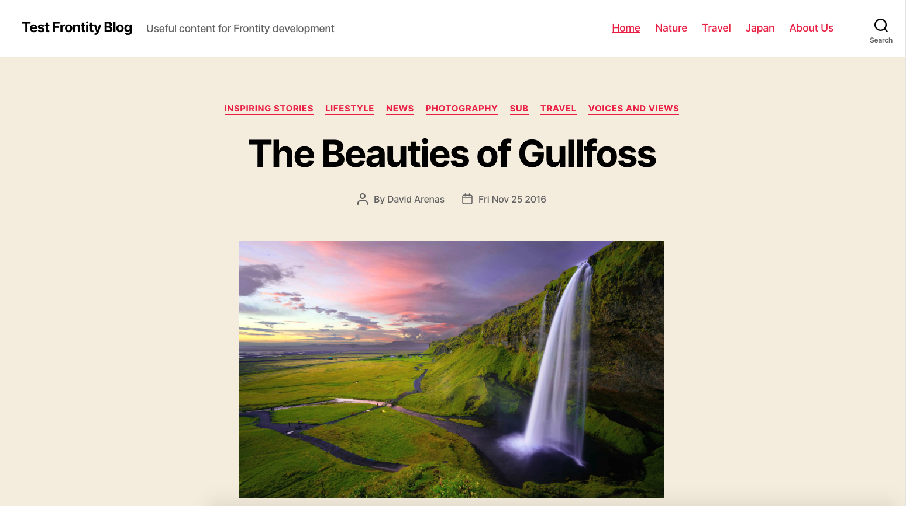

# @frontity/twentytwenty-theme

## Description

The **Twenty Twenty** default WordPress theme was included in WordPress 5.3 and we ported it over to Frontity so users can use it in a headless setup as well. You can check out its **code** and structure on our [GitHub repo](https://github.com/frontity/frontity/tree/dev/packages/twentytwenty-theme) and find it on [npm](https://www.npmjs.com/package/@frontity/twentytwenty-theme).

These are some of the key features included in this theme:

**Accessibility Ready**

The theme is accessible and screen-reader friendly. We added the proper landmarks, roles and labels. We also paid attention to trap focus within modals, ensure focus indicator is visible for all interactive elements.

**Custom Colors**

You can give your website or blog a personal touch by changing the background colors, text colors and primary/accent color in the theme settings. You change the color in one place, all visual elements get updated.

**Search**

The theme comes with a built-in search box to make it easy for your readers to look for specific content. Search box is powered by the robust and performant search engine built into WordPress.

**Featured Images**

Show beautiful featured images for your blog posts. Frontity uses the featured image uploaded to WordPress and renders it on every blog post. You can also opt out of this in the theme settings.

**Content Prefetch**

You can prefetch page for any link to provide an almost instant user experience. All you need do is to change your settings to prefetch pages when the user "hovers" on a link, when the link is visible on screen, or prefetch all links on the current page.

**Pagination**

Frontity's theme has the same pagination as the original WordPress theme. This way you can have access to different pages in the footer, and navigate easily between pages.

## Demo



You can check out all the features in this [**theme demo**](https://twentytwenty.frontity.org/), \_\*\*\_or even in our [Frontity blog](https://blog.frontity.org/).

## Settings

In this theme, apart from changing the colors, you can select other options. You can configured it via the `frontity.settings.js` file. The theme options can be specified in the `state.theme` property.

Here you have an example of a possible configuration \(each setting is explained later in detail\):

```javascript
{
  name: "@frontity/twentytwenty-theme",
  state: {
    theme: {
      menu: [
        ["Home", "/"],
        ["Nature", "/category/nature/"],
        ["Travel", "/category/travel/"],
        ["Japan", "/tag/japan/"],
        ["About Us", "/about-us/"]
      ],
      colors: {
        primary: "#E6324B",
        headerBg: "#ffffff",
        footerBg: "#ffffff",
        bodyBg: "#f5efe0"
      },
      showSearchInHeader: true,
      showAllContentOnArchive: false,
      featuredMedia: {
        showOnArchive: true,
        showOnPost: true
      },
      autoPreFetch: "hover",
      fontSets: "us-ascii"
    }
  }
},
```

All the settings and their description:

| Key | Description | Default value |
| :--- | :--- | :--- |


| **menu** | Menu links to display in the header | \[\] |
| :--- | :--- | :--- |


| _colors_.**primary** | Used throughout most of the application to style links and other common elements. | `#cd2653` |
| :--- | :--- | :--- |


| _colors_.**headerBg** | Color of the header background. | `#ffffff` |
| :--- | :--- | :--- |


| _colors_.**footerBg** | Color of the footer background. | `#ffffff` |
| :--- | :--- | :--- |


| _colors_.**bodyBg** | Color of the body background. | `#f5efe0` |
| :--- | :--- | :--- |


| **showSearchInHeader** | Whether to show the search button in page header | true |
| :--- | :--- | :--- |


| **showAllContentOnArchive** | Whether to show all post content or only excerpt in archive view | false |
| :--- | :--- | :--- |


| _featuredMedia_.**showOnArchive** | Whether to show featured image on archive view | true |
| :--- | :--- | :--- |


| _featuredMedia_.**showOnPost** | Whether to show featured media on post view | true |
| :--- | :--- | :--- |


<table>
  <thead>
    <tr>
      <th style="text-align:left"><b>autoPreFetch</b>
      </th>
      <th style="text-align:left">
        <p>Whether to auto-fetch links on a page. Possible values:</p>
        <ul>
          <li><code>no</code>: don&apos;t auto-tech any links</li>
          <li><code>all</code>: auto-fetch all the links of the page</li>
          <li><code>in-view</code> : auto-fetch just the links that are in-view</li>
          <li><code>hover</code> : auto-fetch links when hover</li>
        </ul>
      </th>
      <th style="text-align:left">no</th>
    </tr>
  </thead>
  <tbody></tbody>
</table><table>
  <thead>
    <tr>
      <th style="text-align:left"><b>fontSets</b>
      </th>
      <th style="text-align:left">
        <p>Which font set to use:</p>
        <ul>
          <li><code>us-ascii</code>
          </li>
          <li><code>latin</code>
          </li>
          <li><code>all</code>
          </li>
        </ul>
      </th>
      <th style="text-align:left">all</th>
    </tr>
  </thead>
  <tbody></tbody>
</table>There are some actions used along the theme that you may need useful:

#### actions.theme.openMobileMenu

It changes `state.theme.isMobileMenuOpen` to `true`, so it opens the mobile menu.

#### actions.theme.closeMobileMenu

It changes `state.theme.isMobileMenuOpen` to `false`, so it closes the mobile menu.

#### actions.theme.openSearchModal

It changes `state.theme.isSearchModalOpen` to `true`, so it opens the search bar.

#### actions.theme.closeSearchModal

It changes `state.theme.isSearchModalOpen` to `false`, so it closes the search bar.

### Libraries

This theme doesn't have its own libraries, but it includes the image processor of [@frontity/html2react](../api-reference-1/frontity-html2react.md), so all the `` tags are converted into the [`<Image />` component](../api-reference-1/frontity-components.md#image).

