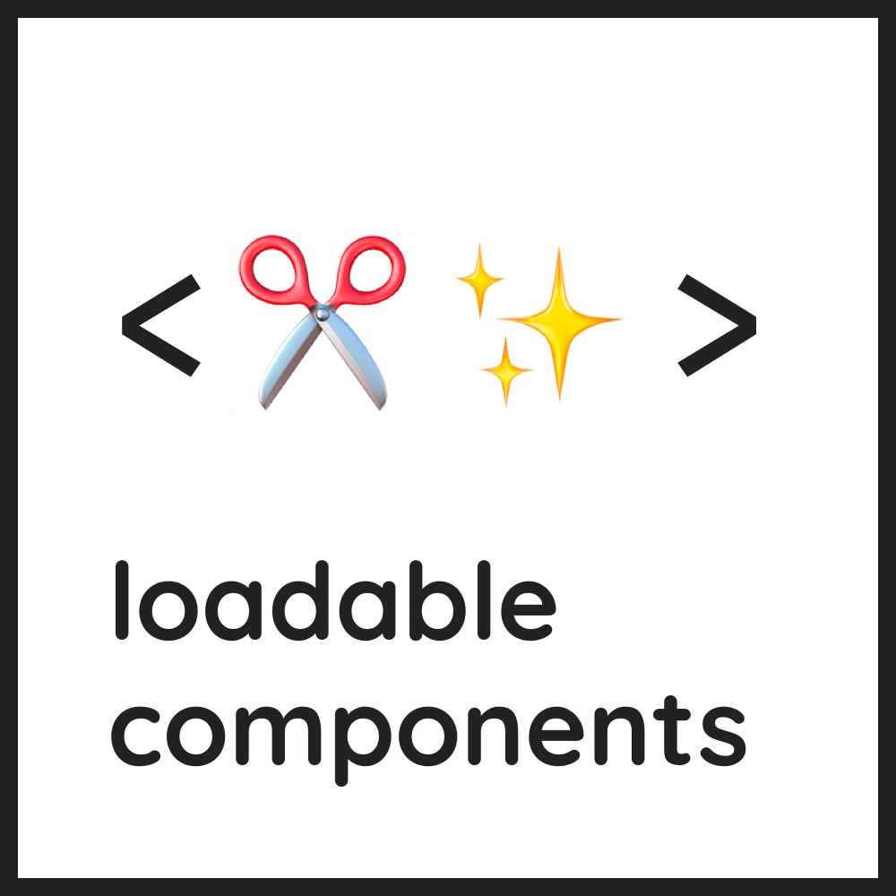

# 10. Code Splitting

Code Splitting lets you split your code into various bundles, instead of using a single one with all the code. These smaller bundles are dynamically loaded at runtime depending on the URL. If used properly, this can mean important performance gains.

The bundles can be loaded on demand or in parallel, which allows you to just load the code that is currently needed by the user. This way you can avoid loading heavy code until it is required and reduce the amount of code during the initial load.

Frontity has configured everything to make Code Splitting really easy. To use it you just have to import `{ loadable }` module from `frontity` and make a dynamic import of the React component you don't want to be loaded until it is strictly needed. 

```jsx
import { loadable } from "frontity";
const OtherComponent = loadable(() => import('./OtherComponent'))

function MyComponent() {
  return (
    <div>
      <OtherComponent />
    </div>
  )
}
```

## Code Splitting Use Case: Comments

Imagine you are using a big library for showing your comments. You will want to load it just when it is needed, so it doesn't increase the bundle size if that React component is not loaded. Code splitting lets you do it.

You have to use `loadable` with a dynamic `import()` inside:

```jsx
import { loadable } from "frontity";
import Content from "./components/content";

// Thanks to loadable we prevent comments from loading until it's needed.
const HeavyComments = loadable(() => import('./components/comments'));

const Post = ({ state }) => (
    <>
        <Content />
        {state.comments.areOpened && <HeavyComments />}
    </>
);

export default connect(Post);
```

Instead of using the normal `import ... from`.

```jsx
import { loadable } from "frontity";
import Content from "./components/content";
import HeavyComments from "./components/comments";

const Post = ({ state }) => (
    <>
        <Content />
        {state.comments.areOpened && <HeavyComments />}
    </>
);

export default connect(Post);
```

By default, `state.comments.areOpened === false` . The heavy library used for comments won't be loaded until you change the state to `true`, like when, for example, you click a button to open the comments. At that moment, the code for that React component is downloaded and executed.

If we don't use `loadable` , the `<HeavyComments>` component is included in the main bundle and loaded at the initial page load, even if the comments are never shown.

## Loadable Components Documentation

For managing the Code Splitting, Frontity has integrated and configured [Loadable Components](https://www.smooth-code.com/open-source/loadable-components/docs/code-splitting/).


 
If you want to go deeper, you should take a look at [**their docs**](https://loadable-components.com/docs/getting-started/). You don't need to read the docs on how to install and configure Loadable Components since we have already done that work for you. Below are concepts that are interesting and helpful to read up on:

* What is [_Code Splitting_](https://loadable-components.com/docs/code-splitting/)?
* Most of the time, you want to [_prefetch_](https://loadable-components.com/docs/prefetching/) a component, it means it will be loaded when the browser is idle. 
* Specify a [_Fallback_](https://loadable-components.com/docs/fallback/) in loadable options. 
* Handle loading errors with [_Error Boundaries_](https://www.smooth-code.com/open-source/loadable-components/docs/error-boundaries)
* To avoid flashing a loader if the loading is very fast, you could implement a minimum [_Delay_](https://www.smooth-code.com/open-source/loadable-components/docs/delay/)
* Infinite loading is not good for user experience, to avoid it implementing a [_timeout_](https://www.smooth-code.com/open-source/loadable-components/docs/timeout/) is a good workaround. 
* Use [Library Splitting](https://www.smooth-code.com/open-source/loadable-components/docs/library-splitting/) to defer the loading of a library
* Create a reusable Loadable Component by using a [_Dynamic Import_](https://www.smooth-code.com/open-source/loadable-components/docs/dynamic-import/)
