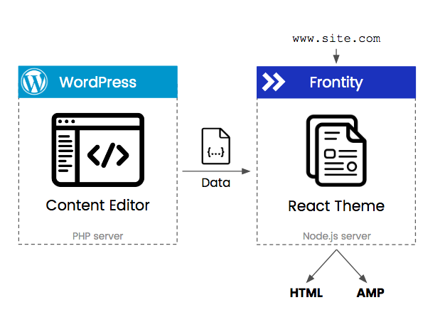
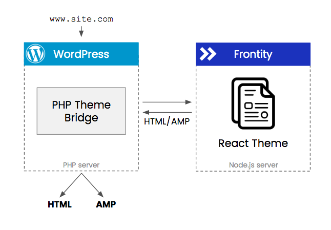

# Possible Installations

As you may know, in order to have Frontity running, you will need to adapt your configuration since it requires you to use Node. We strongly recommend the "**Direct to Frontity**" installation as it matches most user's needs, but we are developing new options in case it doesn't fit yours.

### Installations

* [Direct to Frontity](possible-architectures.md#direct-to-frontity)

### 🔜 Coming soon

* [PHP Theme Bridge](possible-architectures.md#php-theme-bridge)
* [Static Rendered HTML](possible-architectures.md#static-rendered-html)
* [React-only PHP theme](possible-architectures.md#react-only-php-theme)
* [Static HTML PHP Theme](possible-architectures.md#static-html-php-theme)

## Frontity possible installations

### Direct to Frontity

In this solution, WordPress is used as a headless CMS and we use Frontity to generate and show the final HTML. This means that WordPress is used just for managing the content.

* Frontity uses the WP API to retrieve content and generate the final HTML.
* Frontity is also able to generate AMP pages with the same React code and CSS.

This solution requires a PHP Server for WordPress and a Node Server for Frontity, as well as a new domain for your WordPress site as the main one will be used by Frontity.

| **✅ Pros** | ❌ **Cons** |
| :--- | :--- |
| Perfect fit for users with free WP.com blogs \(myblog.wordpress.com\). | Users need to change their WordPress domain. |
| Fastest server side rendering \(no useless WordPress request needed\). | A Frontity server is needed. |
|  | The server side rendering is still slow if the WordPress site is slow, so it may need a cache layer on top. |


If you choose this solution, you may want to check out our recommendations about selecting a server, your domains and the cache technique at "[Decisions you should take](./#decisions-you-should-take)".


## 🔜 Coming soon

### PHP Theme Bridge


🛠 This installation is still under construction. [Feel free to ask](https://community.frontity.org/c/framework) any questions you might have.


This is a PHP theme that doesn’t generate any HTML. Instead, it does an HTTP call to the Frontity server to retrieve the HTML and outputs that.

With this solution, you won't need a new domain for your WordPress site, but you will still need a PHP Server for WordPress and a Node Server for Frontity.

| ✅ **Pros** | ❌ **Cons** |
| :--- | :--- |
| Users don’t need to change their WordPress domain. | A Frontity server is needed. |
| The cache can be done with WordPress plugins, which know when to invalidate it intelligently. | There is more routing involved \(it goes to WordPress, then Frontity, then WordPress outputs the HTML\). |
|  | Users **must** use a cache plugin or it will be very slow. |


If you choose this solution, you may want to check out our recommendations about selecting a server at "[Decisions you should take](./#decisions-you-should-take)".


### Static Rendered HTML


🛠 This installation is still under construction. [Feel free to ask](https://community.frontity.org/c/framework) any questions you might have.


Users create an HTML file for each possible route at building time. It's like Gatsby or Next.js.

| ✅ **Pros** | ❌ **Cons** |
| :--- | :--- |
| No Frontity server is needed. | You need to generate a new build each time you publish or edit content. |
| No cache is needed. | A static HTML server is needed. |
| Server-side rendering is done at building time, so it is like “instant”. | Users need to move their WordPress site to a different domain. |
|  | Not recommended for big blogs with thousands of posts. |
|  | Not recommended for blogs that update content frequently. |

### React-only PHP theme


🛠 This installation is still under construction. [Feel free to ask](https://community.frontity.org/c/framework) any questions you might have.


This is a PHP theme generated by a Frontity command that renders an empty HTML which only contains the scripts to React. It’s basically a Single Page Application.

| ✅ **Pros** | ❌ **Cons** |
| :--- | :--- |
| No Frontity server is needed. | It doesn’t have server side rendering. |
| Users don’t need to move their WordPress  site to a new domain. | No HTML: bad for SEO. |
| No cache is needed. | Bad for First meaningful paint of Lighthouse \(bad for SEO\). |
|  | Readers don’t see anything until React has finished loading: bad user experience. |
|  | The first React load is slower because it needs to do all the API calls. |

### Static HTML PHP Theme


🛠 This installation is still under construction. [Feel free to ask](https://community.frontity.org/c/framework) any questions you might have.


This is a PHP theme generated by a Frontity command but instead of rendering an empty HTML it includes an HTML file for each possible route.

| ✅ **Pros** | ❌ **Cons** |
| :--- | :--- |
| No Frontity server is needed. | You need to generate a new build each time you publish or edit content. |
| Users don’t need to move their WordPress to a new domain. | Not recommended for big blogs with thousands of posts. |
| No cache is needed. | Not recommended for blogs that update content frequently. |
| A static HTML server is not needed. |  |


Still have questions? Ask [the community](https://community.frontity.org/)! We are here to help 😊


