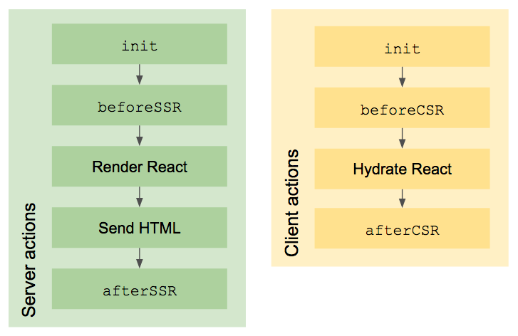

# 6. Actions


This "Learning Frontity" guide is intended to be read in order so please start from the [first section](settings.md) if you haven't done so already.


Actions are a set of functions that your package need to work or exposes for other packages. They can modify the state and don't return anything.

Let's see one simple example:

```javascript
actions: {
    theme: {
        openMenu: ({ state }) => {
            state.theme.isMenuOpen = true;
        },
        closeMenu: ({ state }) => {
            state.theme.isMenuOpen = false;
        } 
    }
}
```

**Actions** are similar to **derived state**. They receive `({ state })` in their argument but that gets stripped out when you consume them:

```jsx
actions.theme.openMenu();
```

And similar to derived state functions, they can also receive arguments if they are declared using a second function:

```javascript
actions: {
    theme: {
        setMenu: ({ state }) => value => {
            if (value === "open")
                state.theme.isMenuOpen = true;
            else if (value === "closed")
                state.theme.isMenuOpen = false;
        },
    }
}
```

And they are consumed like this:

```jsx
actions.theme.setMenu("open");
```

Actions can be used either by their own packages or by other packages.

For example, `tiny-router` \(and all packages that want to implement the `router` API\) exposes the action `actions.router.set()`. This action modifies `state.router.link` and makes sure that the URL of your browser is in sync. Additionally, `tiny-router` also runs this actions if users click on the _back_ and _forward_ buttons of their browsers.

By the way, you can access the actions in the client console using:

```text
> frontity.actions
```

### Actions triggered by Frontity

There are a set of special actions that Frontity runs at appropriate moments:



* `init` _– client and server – async_ Packages can use this action to initialize their internal libraries. Packages should not use actions or libraries from other packages as they could be not properly initialized.
* `beforeSSR`: _– server only – async_ The main purpose of this action is to prepare the state for the React render made in the server. Packages can populate it with content fetched from external APIs, like the WP REST API. They can also interact with other packages if necessary.
* `afterSSR`: _– server only_ This action runs when the HTML has been sent to the client. Packages should not rely in this action except for logging purposes because serverless providers sometimes kill the server after the HTML has been sent.
* `beforeCSR`: _– client only – async_ This action is run before React is hydrated. It's not widely used because here the state that React needs for the hydration is already received from the server.
* `afterCSR`: _– client only_ This action is run after React has been hydrated in the client and it has taken control of the page. This is where packages with client side logic can start doing their thing.

